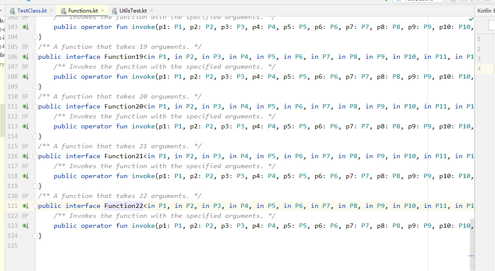

> 最近开始学习 Kotlin 语言了，打算搞个笔记系列，这是首篇~

## 1. 基本类型
```
    var age: Int = 123    // 标准语法，声明一个可变变量 age
    val name: String = "Tom"    // 标准语法，声明一个不可变变量 name (不可变变量不是常量)
    val sex: String? = null    // 声明一个可为空的字符串变量 sex，String 与 String? 不是同种类型
```
String 和 String? 是两种类型，前者修饰的变量不可为 null 空值；后者加了 “?” 之后修饰的变量就可以为 null 了，这也是 kotlin 空安全的一种体现。  

当编译器可以推断出变量的数据类型时，可以不用写冒号和后面的数据类型，例如：
```
    var age = 123    // 可推断出 age 为 Int，所以可不写
    val name = "Tom"    // 可推断出 name 为 String，所以可不写
```
双感叹号 “!!” 可以强转类型，如下代码。 name2 是可为空的 String? 类型，直接赋给不可为空的 name1 就会报错。如果确定 name2 一定不为空，则可以在后面加上 "!!" 强转。
```
    var name1: String = "Tom"    // name1 不可为空
    var name2: String? = "Jack";    // name2 可为空
    //name1 = name2    // 报错
    name1 = name2!!
```

## 2. 关键字
1. open 。被声明为 open 的 class 是可以被继承的，这里注意下 kotlin 中一个类是默认被修饰为 final 的，即默认的类是不能被继承的。


## 3. 函数
kotlin 函数前有 fun 关键字，返回值类型要写在入参括号后和函数体大括号前：
```
fun main() {
    printLen("栗子")
}

fun printLen(str: String): String {
    println("举个 $str !")    // 这种写法类似于 C 语言了
    return str
}

// Kotlin 函数参数还可以设置默认值
fun printLen(str: String = "我是默认值~"): String {
    println("举个 $str !")    // 这种写法类似于 C 语言了
    return str
}
```

## 4. Kotlin 方法可以直接写在 .kt 文件里，不用写在某个类中
例如有个 Util.kt 的文件，里面有许多工具类的方法，如果在 Java 中，就必须在类中编写代码：  
```
public class Utils {
    public static final void echo(String name) {
        println("name = " + name);
    }
}
```
调用时，就是：
```
Utils.echo("Hello UnderWorld! ");
```
而在 Kotlin 代码中，可以直接在 Util.kt 文件中这么写：
```
// Util.kt 文件
fun echo(name: String) {
   println("name = $name")
}
```
在 Java 代码里调用就可以直接这么写：
```
// Main.java 文件
public static void main(String[] args) {
    UtilKt.echo("Hello World! ");
}
```

## 5. 与 Java 代码之间的互调
```
object Test {    // Kotlin 代码里 匿名内部类 的写法
    fun say(msg: String) {
        println(msg)
    }
}
```
在 kotlin 代码中调用 Test 中的 say 方法：
```
Test.say("Good Morning~")
```
在 Java 代码中调用，则：
```
Test.INSTANCE.say("Good Morning~")
```
在 kotlin 中调用一个 Java 类，不能像在 Java 中一样写成这样： Test.class ，而是要这样写：Test::class.java。另外 Kotlin 类是被编译为 KClass 文件，而不是 class 文件。所以，在 Kotlin 代码里，如果要调用一个 Kotlin 的类，则不用加 .java 后缀，而是直接写成：Util::class。

## 6. Java 与 Kotlin 之间的冲突解决
1. 关键字冲突。比如 in 这个关键字，在 Kotlin 中是一个关键字，如果要引用 Java 类中一个叫 in 的对象时，则需要用反引号 ` 解决这个冲突：
```
Utils.`in`   // 在 Utils.java 中，in 是一个属性：public static int in = 100;
```
2. Kotlin 没有封装类。Kotlin 中没有像 Integer 的封装类，只有 Int 等基本类型，只有通过反射的方式才能调用或用于鉴别 Integer 的封装类类型。
这里给出几个网上应用的例子，实际中使用时，再补充。  
1）在 kotlin 代码中使用 Integer.class 。假如 Java 类中有方法： void func(Class clazz){} ，那么在 Kotlin 中如果需要传入一个 Integer.class 该怎么办？正确的做法是： func(Int::class.javaObjectType) ，而不是 func(Int::class.java)
2）Int::class.java 指向的是 kotlin 标准库中的 Int.kt ； Int::class.javaObjectType 指向的是 JDK 里的 Integer.java 类。
3. Kotlin 是空安全的。Kotlin 如果调用了 Java 中的代码，则需要用 ***? 的类型来接收，这样可以防止空指针异常。例如 Java 中是 String 类型的对象，要在 Kotlin 中使用的话，需要用 String? 类型来接收。
4. Kotlin 没有静态变量和静态方法。没有静态方法的问题，可以在方法前添加 @JvmStatic 注解来解决：
```
object Utils {
    @JvmStatic
    fun getName(): String{
        return "hehe"
    }
}
```
当然也可以将方法写在类的 companion object {} 中。

## 7. 扩展函数
kotlin 支持给原有的类添加一些扩展的功能，就是通过扩展函数来实现的。可以针对第三方库中对象添加一些我们需要的方法。例如我们可以扩展一下 User 类中的方法：
```
fun User.getInfo(): String {    // 原本的 User 类中是没有 getInfo 方法的
    return uid.toString() + name
}
```
这样，我们相当于给 User 类添加了一个方法 getInfo，然后 User 类的对象都可以调用 getInfo 方法了。请注意这里的扩展函数是静态添加给这个类的，不具备运行时的多态的。可以看下面的代码：
```
open class Animal    // 父类
class Dog: Animal()    // 子类

fun Animal.name() = "animal"    // 父类扩展函数 name，返回 animal 
fun Dog.name() = "dog"    // 子类扩展函数 name，返回 dog

fun Animal.printName(animal: Animal) {    // 父类扩展函数 printName，调用的是父类对象的 name 函数
    println(animal.name())
}

fun main(args: Array<String>) {
    Dog().printName(Dog())    // 打印的结果是 “animal”，这说明扩展函数不具备运行时多态的特点。
}
```
将这段代码反编译成 Java 代码，可以看到最终调用的 Dog().printName(Dog()) 这段代码，被编译成了 printName((Animal)(new Dog()), (Animal)(new Dog())); ，即最后调用会将 Dog 对象强转为 Animal 对象，这样就不具有多态的特点了。

## 8. Lambda 闭包
1. Lambda 闭包声明，可以为：
```
// lambda 闭包
val print = {name: String ->    // 闭包名声明为 print，闭包还允许添加参数，这里声明了一个 name 的参数
    println(name)
}
```
这里闭包中的参数个数是有限制的，上限为 22个。因为 Kotlin 只为我们定义了含有 22 个参数的 Function22，如图所示：   
          

如果我们需要用到 23个参数的 Lambda 闭包该怎么办呢？这个时候我们就需要手动声明一个kotlin包中的 Function23。这里需要手动定义一个 Java 类的 Function23，因为只有一个kotlin标准库才可以声明一个kotlin包名，而我们自己是不能声明一个类的包名为kotlin的，但是 Java和kotlin是互通的，所以我们可以将这个Function23 声明为一个 Java类，并将它的包名设置为kotlin，这样就可以声明参数个数超过 22 的闭包了。
```
package kotlin;

public interface Function23<P1, P2, P3, P4, P5, P6, P7, P8, P9, P10, P11, P12, P13, P14, P15, P16, P17, P18, P19, P20, P21, P22, P23, R> extends Function<R> {
    R invoke(P1 p1, P2 p2, P3 p3, P4 p4, P5 p5, P6 p6, P7 p7, P8 p8, P9 p9, P10 p10, P11 p11, P12 p12, P13 p13, P14 p14, P15 p15, P16 p16, P17 p17, P18 p18, P19 p19, P20 p20, P21 p21, P22 p22, P23 p23);
}
```

## 9. 高阶函数
高阶函数的特点：函数（Lambda）的参数也是一个函数（Lambda）。
知识点1：函数默认的返回值为一个 Unit 类型的对象，可以不写。但如果这个函数是作为一个参数，那么返回类型一定要写:    
```
// 只有当 isDebug 为 true，才会执行后面的 block 函数.  block 函数是作为一个参数，所以返回类型要显式写出
fun Onlyif(isDebug: Boolean, block: () -> Unit) {
    if (isDebug) block()
}

fun main() {
    val runnable = Runnable {
        print("Runnable run!")
    }
    val function: () -> Unit
    function = runnable::run    // Runnable 只有一个 run 方法，所以可以直接用双冒号进行调用
    Onlyif(true, function)
}
```
Kotlin 的 Lambda 会编译为一个匿名内部类，可以使用 inline 关键字来修饰方法，这样当方法在编译时就会拆解方法的调用为语句调用，进而减少创建不必要的对象。
但要注意，过多使用 inline 关键字会增加编译器的编译负担，所以 inline 只适合修饰高阶函数，例如上述的高阶函数就可以用 inline 修饰：
```
inline fun Onlyif(isDebug: Boolean, block: () -> Unit) {
    if (isDebug) block()
}
```

## 10. 类与对象
1. Kotlin 类默认是被 public final 修饰的，默认的父类是 Any，而不是 Object。
2. Kotlin 类的构造函数会默认调用 init 方法，所以可以在 init 方法中执行一些初始化的操作：
```
class TestView: View {
    constructor(context: Context): super(context)

    constructor(context: Context, attrs: AttributeSet?) : this(context, attrs, 0)

    constructor(context: Context, attrs: AttributeSet?, defStyleAttr: Int) : super(context, attrs, defStyleAttr)
    
    init {
        print("构造函数已执行~")
    }
}
```
3. 四种访问修饰符，分别是 private、protected、public、internal。前三种与 Java 相同，internal 表示 module 模块内部是都可以访问的，而其他 module 是无法访问的。
4. Kotlin 的伴生对象。可以实现静态方法和静态变量：
```
class StringUtils {
    // 伴生对象
    companion object {
        // 伴生对象实现静态变量
        val TAG = "StringUitls"
        // 伴生对象实现静态方法
        fun isEmpty(str: String) : Boolean {
            return "" == str
        }
    }
}
```
5. Kotlin 中的单例的实现。可以使用伴生对象来实现 kotlin 的单例：
```
// 单例实现
class SingleInstance private constructor() {
    companion object {
        fun get() : SingleInstance {
            return Holder.instance
        }
    }
    
    private object Holder {    // 通过 object 创建一个匿名内部类
        val instance = SingleInstance()
    }
}
```

还没看够？来我的公众号看看？搜索： **俢之竹**   
或者扫一扫下面的二维码：  

   

来知乎逛逛也是可以的，搜索： **俢之竹**   

##  参考文献
- [从Kotlin访问Integer.class ](https://www.javaroad.cn/questions/299414)
- [Kotlin 调用Java写的方法，参数Class<T> 神坑](https://www.jianshu.com/p/6bfbbbcb5c8a)

ps. 赠人玫瑰，手留余香。欢迎转发分享，你的认可是我继续创作的精神源泉。   