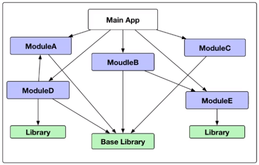
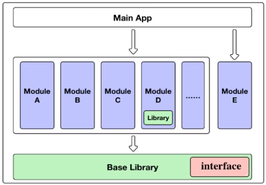
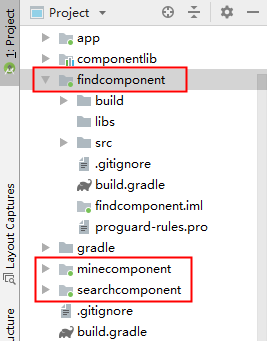
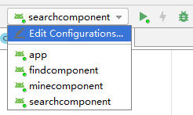
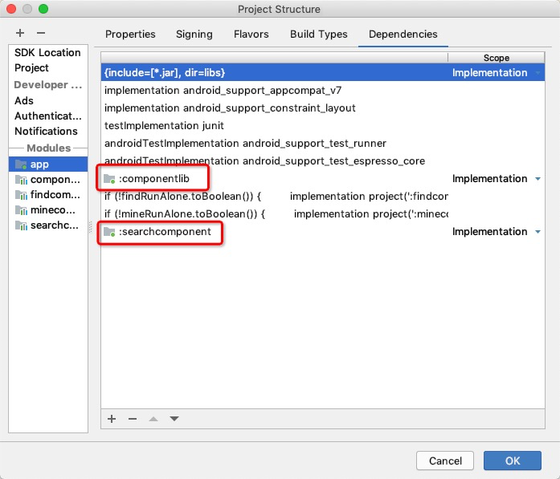

## 引子
一般情况下，一个 Android 项目，随着业务的发展和扩张，会有许多 Activity、Fragment 等文件，如果没有一个好的架构，整个项目将会变得非常混乱，如下图图1所示。最直观的感受就是文件巨多所导致的人工手动搜索时长耗时严重。。。长此以往更会拖慢整个项目的编译速度，甚至是修改一个 Java 代码中的数字就要编译个七八分钟。   


为了解决上述的这些问题，我们可以将 App 进行拆分，组件化实现。其实大公司的 App 基本上都是这种类似的架构，比如美团 App、知乎 App 等，整体的项目是一个 App 的空壳，而几个大的业务线均抽离出来形成几个互相独立的模块。

## 目的
我们要进行组件化的目的，就是要降低模块间的耦合度，从而更好的进行维护，加快编译速度，提高开发效率。模块相比于组件，模块的体量更大，更偏向于业务；而组件颗粒度更小，且更偏向于功能。不同的业务模块可以用相同的组件进行实现，项目的开发人员较多的话，也方便根据组件来划分工作职责。

一个好的架构设计如图 2 所示。可以看到，Main App 差不多就是一个空壳，里面是由许多组件 Module A、Module B······所组成的业务模块构成的。Base Library 的作用就是为了实现各个 Module 之间的解耦。它是用这个 interface 来实现解耦的。

比如 Module A 中的有个 loginActivity 要跳转到 Module B 中的 homeActivity，最初的做法有两种：一种是 Intent 显示跳转，这种方法要在 loginActivity 中实例化 homeActivity，耦合性太强。 
```
Intent intent = new Intent( loginActivity.this, homeActivity.class );
startActivity(intent);
```
另一种是 Intent 隐式跳转，要在 AndroidManifest 文件里配置，也不是很好。而图 2 中的设计，就是让 BaseLibrary 专门来负责组件之间的通信，各个组件通过实现它里面的 interface 来实现组件之间的相互解耦。
## 正式开干
### 1、准备工作
首先当然是新建一个主项目，然后，依次点击 File - New - Module - Phone & Tablet Module，创建一个组件，我这里创建了三个组件，findcomponent 和 minecomponent、searchcomponent. 创建完之后如图 3 所示。从图中也可以看出，一个 Module 的文件目录很像一个完整的项目，其实此时它们是可以分别单独部署运行的。如图 4 所示，我们可以自行选择要执行哪一个组件。它们此时是相互独立的，分别部署到手机上也是几个不同的 App。为了演示方便，各个组件中创建的 Activity 以及布局文件均十分简单。   
  



### 2、配置 gradle.properties 文件
如何将这些组件集成到主 App 上，同时又可以单独运行呢？第一步，要配置一下 gradle.properties 文件。
```
# 配置某个组件是否可独立运行
findRunAlone = true
mineRunAlone = true
searchRunAlone = true
```
这三行代码是初始化三个标记位，用来设置三个组件是否集成到主 App 中，设置为 true 则可独立运行；false 则作为主 App 的 library 运行。当然上述只配置了一半，还要在各个组件的 gradle 文件中作相应的修改：
```
if(searchRunAlone.toBoolean()){
    apply plugin: 'com.android.application'
}else{
    apply plugin: 'com.android.library'
}

if(searchRunAlone.toBoolean()){    // 独立运行时需要设置 applicationId
    applicationId "com.example.wen.searchcomponent"
}
```
这里只拿 searchComponent 组件进行演示。
在 gradle.properties 文件中，还可以将整个项目中所用的 SDK 版本、依赖库的版本进行声明，统一各个组件所用的 SDK 版本及各种依赖库的版本。例如，在此 gradle.properties 文件中添加以下代码：
```  
# 全局配置 gradle 环境
compile_sdk_version = 28
min_sdk_version = 23
target_sdk_version = 28

# 配置其他依赖库
android_support_appcompat_v7 = com.android.support:appcompat-v7:28.0.0
android_support_constraint_layout = com.android.support.constraint:constraint-layout:1.1.3
junit = junit:junit:4.12
android_support_test_runner = com.android.support.test:runner:1.0.2
android_support_test_espresso_core = com.android.support.test.espresso:espresso-core:3.0.2
android_support_support_v4 = com.android.support:support-v4:28.0.0
```
这样初始化声明以后，就可以在各个组件中引用，达到统一版本，避免各个组件所用库版本不一致而收到的影响。
比如在 searchComponent 组件中 gradle 文件中，我们就可以这样设置：
```
// 设置 sdk version
compileSdkVersion compile_sdk_version.toInteger()
    defaultConfig {
        if(searchRunAlone.toBoolean()){
            applicationId "com.example.wen.searchcomponent"
        }
        minSdkVersion min_sdk_version.toInteger()
        targetSdkVersion target_sdk_version.toInteger()
    }

// 引用主 APP gradle.properties 文件中的声明来设置各个依赖库的版本
dependencies {
    implementation fileTree(dir: 'libs', include: ['*.jar'])

    implementation android_support_appcompat_v7
    implementation android_support_constraint_layout
    testImplementation junit
    androidTestImplementation android_support_test_runner
    androidTestImplementation android_support_test_espresso_core
}
```

### 3、配置 AndroidManifest.xml 文件
Library 与 Application 的区别不仅仅体现在 gradle.properties 中，而且还体现在 AndroidManifest 文件中。所以组件在切换 Library 与 Application 时也要切换不同的 AndroidManifest 文件。
首先在 gradle 中进行设置：
```
sourceSets{
        main{
            // 独立运行与集成调试时使用不同的 AndroidManifest.xml 文件
            if( searchRunAlone.toBoolean() ){
                manifest.srcFile 'src/main/AndroidManifest.xml'
            }else{
                manifest.srcFile 'src/main/manifest/AndroidManifest.xml'
            }
        }
    }
```
即当组件是作为 Application 运行时，所用的 AndroidManifest 文件就是 main 目录下的，即之前 IDE 自己生成的；当组件是作为 Library 运行时，所用的就是 main/manifest 目录下的。所以我们要在 main 目录下创建一个 manifest 目录，并新建一个 AndroidManifest 文件，只需要将 Library 中必需的属性加上即可：
```
<?xml version="1.0" encoding="utf-8"?>
<manifest xmlns:android="http://schemas.android.com/apk/res/android"
    package="com.example.wen.searchcomponent">
    <!-- 组件中有 searchActivity 故加入进去 -->
    <application>
        <activity android:name=".searchActivity">
        </activity>
    </application>
</manifest>
```
### 4、创建 BaseLibrary 实现组件解耦
通过上述步骤，我们就创建了一个组件，重复上述步骤多创建几个不同的组件。接下来就是创建这些组件之间的“桥梁”，图 3 中出现的 componentlib 包其实就是那座“桥”，也就是 BaseLibrary.  用于组件之间的通信，从而实现解耦，阿里的 [ARouter](https://github.com/alibaba/ARouter) 也是类似的作用（自己还没有了解，这里引用老师所说的，欢迎拍砖指教）。
   
首先要把之前创建的组件切换成 Library ，即
```
# 配置某个组件是否可独立运行
findRunAlone = false
mineRunAlone = false
searchRunAlone = false
```
然后在 app 中的 gradle 文件中将这些组件引用到主项目中，当然是在各个组件作为依赖的情况下：
```
    if (!findRunAlone.toBoolean()) {
        implementation project(':findcomponent')
    }
    if (!mineRunAlone.toBoolean()) {
        implementation project(':minecomponent')
    }
    if(!searchRunAlone.toBoolean()){
        implementation project(':searchcomponent')
    }
```
接下来，依次打开 File - New - Module - Android Library 来创建一个 Library，取名为ComponentLib.  接下来就是配置项目结构，即各个组件与主 APP 之间的依赖关系。打开 Project Structure，在 Module 中可以看到已经创建的几个模块，包括 app、componentlib、searchcomponent 等。根据图 2 的整体架构图，app 是要添加所有的组件作为它的依赖库的，所以依次选择 Dependencies - 左下角 + 号 - Module Dependency，将组件全部添加进去，如图 5 所示；同样地操作，SearchComponent 等组件均要添加 componentlib 作为基础依赖。


注意： 如果在你打开的 Project Structure 并不是上图的形式，可能是 AndroidStudio 版本不同，比如在 AndroidStudio 3.6 以上的版本，不用配置这个项目结构，直接在 gradle implemention project 就可以了。  

从图 2 中也可以看出，BaseLibrary 主要是通过 interface 这个接口来实现解耦的，那么接下来就是在 componentLib 中创建 interface 接口，并在相应的组件中实现这个接口了。
#### 1）创建 BaseLibrary 的 interface 接口
在 BaseLibrary 中创建 SearchComponent 的接口：
```
public interface ISearchService {
    void launch(Context context, String targetClass);
    Fragment newSearchFragment(FragmentManager fragmentManager, int viewId, Bundle bundle);
}
```
接口中写明要在 SearchComponent 组件中实现的方法，用于一些操作。第一个方法就是调用组件中 Activity 的方法；第二个方法是调用组件中的 Fragment 的方法。
#### 2）组件实现 BaseLibrary 中的 interface 接口
回到 SearchComponent 组件，创建一个 SearchService 类实现 ISearchService 接口，
```
public class SearchService implements ISearchService {
    @Override
    public void launch(Context context, String targetClass) {
        Intent intent = new Intent(context, searchActivity.class);
        intent.addFlags(Intent.FLAG_ACTIVITY_NEW_TASK);
        context.startActivity(intent);
    }
    @Override
    public Fragment newSearchFragment(FragmentManager fragmentManager, int viewId, Bundle bundle) {
        SearchFragment searchFragment = new SearchFragment();
        searchFragment.setArguments(bundle);
        fragmentManager.beginTransaction().add(viewId,searchFragment).commit();
        return searchFragment;
    }
}
```
这里就写这两个函数举例，一个是启动这个 Activity；另一个是实例化一个 fragment。如何调用这两个函数，还要到 ComponentLib 进行相关的配置。
####3）BaseLibrary 实现调用方法管理类
OK, 现在每个组件中都有实现了调用该组件的 service 类了，为了解耦，这些类当然不能由组件自己调用，而是统一交给  BaseLibrary( ComponentLib )进行管理，所以我们要在 ComponentLib 中新建一个 ServiceFactory 类管理各个组件中的 service 类。
```
public class ServiceFactory {
    private static final ServiceFactory instance = new ServiceFactory();
    public static ServiceFactory getInstance(){
        return instance;
    }

    private IFindService mFindService;
    private IMineService mMineService;
    private ISearchService mSearchService;

    public ISearchService getmSearchService() {
        if(mSearchService == null){
            mSearchService = new EmptySearchService();
        }
        return mSearchService;
    }

    public void setmSearchService(ISearchService mSearchService) {
        this.mSearchService = mSearchService;
    }

    public IFindService getmFindService() {
        if(mFindService == null){
            mFindService = new EmptyFindService();
        }
        return mFindService;
    }

    public void setmFindService(IFindService mFindService) {
        this.mFindService = mFindService;
    }

    public IMineService getmMineService() {
        if(mMineService == null){
            mMineService = new EmptyMineService();
        }
        return mMineService;
    }

    public void setmMineService(IMineService mMineService) {
        this.mMineService = mMineService;
    }
}
```
首先要创建一个 ServiceFactory 的单例，在我们的例子中有三个组件，所以这里创建了三个不同的 service 类，并加上它们的 get 和 set 方法，这里出现的 Empty***Service 类是为了提高程序的健壮性，后面会继续说。

####4）项目 Application 管理
组件化设计架构中，必然会牵扯到 Application 管理的问题，主 app 中的 Application 倒是没有什么问题，但要保证各个组件既能独立于主 app 运行，又能作为 Library 支持主 app 的运行，它们的  Application 就要进行相应地管理了。就是说，当组件独立运行时，使用自己的 Application；当组件非独立运行时，使用主 app 的Application，这就需要先在各个组件中创建类进行管理或者说切换。在 SearchComponent 中我们创建一个 SearchApplication 类：
```
public class SearchApplication extends Application {

    private static Application application;
    public static Application getApplication(){
        return application;
    }

    @Override
    public void onCreate() {    // 如果 SearchComponent 是个 Application 时，会调用这个方法
        super.onCreate();
    }
}
```
怎样才能获取到 主 App 中的 Application 呢？在这里我们还要创建一个主 App 中的 Application，在 app 目录中添加如下的 MainApplication 类：
```
public class MainApplication extends Application {
    private static Application application;
    public static Application getApplication(){
        return application;
    }

    @Override
    public void onCreate() {
        super.onCreate();
        initialize(this);    // 暂未实现该方法
    }
}
```
还要修改下 主 App 中的 AndroidManifest 文件，使得启动时运行这个 MainApplication 类，通过 onCreate 方法中的 initialize 方法将 主 App 中的 application 对象传递到各个不同的组件中。
```
<application
        android:name=".MainApplication"
</application>
```
接下来还有几步操作，第一步，就是在 componentlib/service 目录下，新建一个用于初始化的接口：
```
public interface IComponentApp {
    void initialize(Application application);
}
```
所有的 Component 组件都要实现这个接口，用于获取到 主 App 中的 Application 对象。
第二步，就是在刚才的目录下，再新建如下的一个类：
```
public class AppConfig {
    public static final String[] COMPONENTS = {
            "com.daojia.wen.findcomponent.FindApplication",
            "com.daojia.wen.minecomponent.MineApplication",
            "com.daojia.wen.searchcomponent.SearchService"
    };
}
```
这个类中存储的是各个 Component 组件的 Application 类的路径。  
  
第三步，回到 MainApplication 类中，实例化 IComponentApp 接口：
```
public class MainApplication extends Application implements IComponentApp {
    private static Application application;
    public static Application getApplication(){
        return application;
    }
    @Override
    public void initialize(Application application) {
        for(String component: AppConfig.COMPONENTS){
            try{
                // 通过配置文件中的 Application 的路径，实例化，并将 MainApp 的 Application 对象传过去
                Class<?> clazz = Class.forName(component);
                Object object = clazz.newInstance();
                if(object instanceof IComponentApp){
                    ((IComponentApp)object).initialize(this);
                }
            }catch (Exception e){
                e.printStackTrace();
            }
        }
    }
    @Override
    public void onCreate() {
        super.onCreate();
        initialize(this);
    }
}
```
从这个实例化的接口可以看出，在 MainApplication 类中，初始化的时候，是通过反射来实例化各个 Component 组件的 Application，并将 主 App 中的 Application 对象传过去作为各个组件的 Application。

 第四步，在各个 Component 组件中实现 IComponentApp 接口，这里还是以 SearchComponent 组件为例：
```
public class SearchApplication extends Application implements IComponentApp {
    private static Application application;
    @Override
    public void initialize(Application app) {
        application = app;
        ServiceFactory.getInstance().setmSearchService(new SearchService());
    }
    public static Application getApplication(){
        return application;
    }
    @Override
    public void onCreate() {
        super.onCreate();
        initialize(this);
    }
}
```
在组件中，如果该组件被设置为独立运行，则会调用 onCreate() 方法，这时获取到的是它自己的 Application 对象；如果被设置为组件依赖于 主 App 运行，则会在 MainApplication 类中通过反射被实例化，获取到的是 主 App 中的 Application 对象。  
  
到这里有没有发现，我在 initialize 方法中不仅仅将主 App 中的 Application 对象传递进来了，同时我还设置了 SearchService 实例，这个 Service 实例就可以在主 App 中调用 SearchComponent 中的方法了：  
```
public class MainActivity extends AppCompatActivity {

    @Override
    protected void onCreate(Bundle savedInstanceState) {
        super.onCreate(savedInstanceState);
        setContentView(R.layout.activity_main);

        findViewById(R.id.btn_go_search).setOnClickListener(new View.OnClickListener() {
            @Override
            public void onClick(View v) {
                // 去“查找”组件
                ServiceFactory.getInstance().getmSearchService().launch(MainActivity.this,"");
            }
        });

        findViewById(R.id.btn_showSearchUI).setOnClickListener(new View.OnClickListener() {
            @Override
            public void onClick(View v) {
                // 去"查找"组件中的 UI 页面
                Bundle bundle = new Bundle();
                ServiceFactory.getInstance().getmSearchService().newSearchFragment(getSupportFragmentManager(),
                        R.id.container,bundle);
            }
        }); 
    }
}
```  
  
OK，到这里基本上就已经完成了，再回过头来看一看 Empty***Service 类存在的必要性，上文已经说了，是为了提高程序的健壮性，为什么呢？这是为了考虑可能出现的空指针问题。  
  
假如我们在之后要去掉 SearchComponent，如果没有写 EmptySearchService 类，在删除掉 SearchComponent 代码后会出现在 MainActivity 中 ```ServiceFactory.getInstance().getmSearchService() ```为 ```null```的情况，就会报空指针，那么添加 Empty***Service 类就会规避这些问题。  
  
以上内容均来自 网易公开课，感谢。
## 他山之石
1、[Android 高级开发工程师 网易公开课](https://study.163.com/course/courseLearn.htm?courseId=1209146813#/learn/live?lessonId=1278713710&courseId=1209146813)
  
PS: [https://github.com/JinchaoWen/ComponentDemo](https://github.com/JinchaoWen/ComponentDemo)  
码字不易，给个赞吧。赠人玫瑰，手留余香~