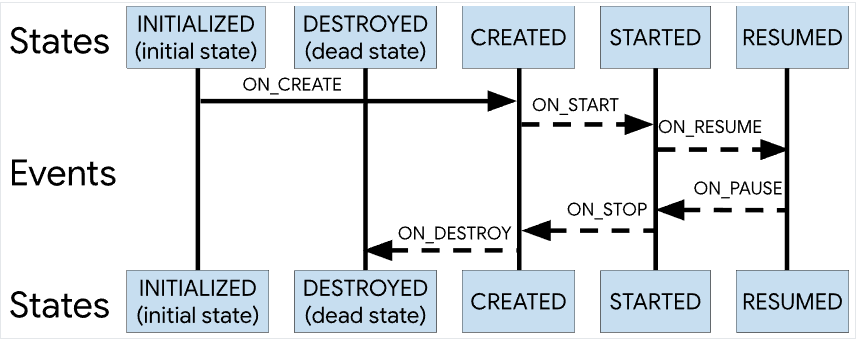

Lifecycle 是 Android Jetpack 工具包中的一个工具库，Jetpack 中的工具可以分为四个部分：架构（Architecture）、基础（Foundation）、行为（Behavior）、界面（UI）。


其中，架构部分是 Jetpack 工具包的精华所在，大家耳熟能详的 DataBinding、LiveData、ViewModel等都是属于 Architecture 架构部分。Lifecycle 的地位就可想而知了。  

# 1、背景
众所周知，Activity 是有自己的生命周期的，从 onCreate 创建一直到 onDestroy 销毁，我们会在 Activity 的各个生命周期中做相应的处理，完成业务逻辑的开发工作。  比如，某些功能组件需要在 Activity 或者 Fragment 的某些生命周期函数中做一些初始化，资源回收等等操作。久而久之，Activity 中的代码体积就会变得臃肿，功能组件也与 Activity 耦合在一起了。

为了解决这个问题，google 就开发出了 Lifecycle 这个工具。

官方文档上有个例子，假如 Activity 中有一个定位的功能组件，如果没有使用 Lifecycle，大致的实现是这样的：
```
    // 1、开发自己的功能组件，实现相关功能
    class MyLocationListener {
        public MyLocationListener(Context context, Callback callback) {
            // ...
        }

        void start() {
            // 连接系统定位服务
        }

        void stop() {
            // 断开系统定位服务
        }
    }

    // 2、在 Activity 中调用自己开发的功能组件，并在 Activity 生命周期中进行相应操作
    class MyActivity extends AppCompatActivity {
        private MyLocationListener myLocationListener;

        @Override
        public void onCreate(...) {
            // 初始化自己开发的功能组件
            myLocationListener = new MyLocationListener(this, (location) -> {
                // 更新 UI
            });
        }

        @Override
        public void onStart() {
            super.onStart();
            myLocationListener.start();
            // 管理其他需要响应 activity 生命周期的组件
        }

        @Override
        public void onStop() {
            super.onStop();
            myLocationListener.stop();
            // 管理其他需要响应 activity 生命周期的组件
        }
    }
```

# 2、Lifecycle 的使用
引入 Lifecycle 之后，我们就可以在定位组件的内部监听到 Activity 的生命周期的变化，从而执行相应的操作。不需要在 Activity 的各个生命周期方法中调用自身的业务逻辑方法，从而实现功能组件与 Activity 的相互隔离与解耦，降低 Activity 中的代码量。  

大体的思想就是一个观察者模式，具有生命周期的 Activity、Fragment 等作为被观察者；需要在不同的生命周期中执行不同的业务逻辑的功能组件作为观察者，当观察者监听到生命周期发生变化时，执行相应的业务逻辑。具有生命周期的 Activity、Fragment 等，在下文中我们用 生命周期持有者（LifecycleOwner）来称呼；我们自己开发的需要依赖于生命周期的功能组件，在下文中用 生命周期观察者（LifecycleObserver）进行称呼。

## 2.1 引入依赖
如果是非 AndroidX 项目，则引入：
```
implementation "android.arch.lifecycle:extensions:1.1.1"
```
如果是 AndroidX 项目，则引入：
```
implementation 'androidx.appcompat:appcompat:1.2.0'
```
如果只需要使用 Lifecycle，不需要其他的 ViewModel、LiveData等等的话，则只需要引入 lifecycle-runtime 包即可。

## 2.2 实现 Lifecycle 观察者
这个 Lifecycle 观察者就是我们自己开发的功能组件，加上 LifecycleObserver 接口就可以通过注解的方式来编码各个生命周期需要执行的业务逻辑。如代码所示：
```
class MyLocationListener implements LifecycleObserver {
    MyLocationListener(Activity activity, OnLocationChangedListener onLocationChangedListener) {
        // 初始化
        initLocationManager();
    }

    // 当 Activity 执行 onResume 方法时，自动调用该方法
    @OnLifecycleEvent(Lifecycle.Event.ON_RESUME)
    private void startGetLocation(){
        Log.i(TAG, "startGetLocation() is executed");
    }

    // 当 Activity 执行 onPause 方法时，自动调用该方法
    @OnLifecycleEvent(Lifecycle.Event.ON_PAUSE)
    private void stopGetLocation(){
        Log.i(TAG, "stopGetLocation() is executed");
    }

    private void initLocationManager(){
        Log.i(TAG, "initLocationManager() is executed");
    }

    // 当位置发生变化时，通过该接口通知调用方
    public interface OnLocationChangedListener{
        void onChange(double latitude, double longitude);
    }
}
```
## 2.3 生命周期持有者添加观察者
在 Android 中具有生命周期的一般是 Activity、Fragment，先通过 getLifecycle 方法获得 Lifecycle 生命周期对象，Lifecycle 对象使用 addObserver 方法给自己添加观察者，即 MyLocationListener。这样一来，当 Lifecycle 生命周期发生变化，MyLocationListener 就会收到通知，做相应的操作。
```
public class MainActivity extends AppCompatActivity {

    @Override
    protected void onCreate(Bundle savedInstanceState) {
        super.onCreate(savedInstanceState);
        setContentView(R.layout.activity_main);

        MyLocationListener myLocationListener = new MyLocationListener(this,
                new MyLocationListener.OnLocationChangedListener() {
            @Override
            public void onChange(double latitude, double longitude) {
                // 位置发生变化时，调用该方法
            }
        });

        // 将观察者（MyLocationListener）与被观察者（MainActivity）绑定
        getLifecycle().addObserver(myLocationListener);
    }
}
```
那么，这种观察者模式是怎样建立起来的呢？我们可以去看看 Jetpack 中 Lifecycle 相关源码。  

# 3、Lifecycle 源码浅析
下面的源码分析是基于 lifecycle-runtime:2.1.0、lifecycle-common:2.1.0 版本。从 getLifecycle() 方法进入，发现是来到了 ComponentActivity 中，ComponentActivity 就是 Activity 的基类，代码如下：
```
    // ComponentActivity.java 类
    @NonNull
    @Override
    public Lifecycle getLifecycle() {
        return mLifecycleRegistry;
    }
```
还可以看出，其实 ComponentActivity 只是实现了 LifecycleOwner 这个接口：
```
// LifecycleOwner.java 接口文件
public interface LifecycleOwner {
    /**
     * Returns the Lifecycle of the provider.
     *
     * @return The lifecycle of the provider.
     */
    @NonNull
    Lifecycle getLifecycle();
}

// ComponentActivity 实现了 LifecycleOwner 接口
public class ComponentActivity extends androidx.core.app.ComponentActivity implements
        LifecycleOwner,
        ViewModelStoreOwner,
        SavedStateRegistryOwner,
        OnBackPressedDispatcherOwner {
        ···
}
```
回过头来再看看 ComponentActivity 中的 getLifecycle 方法，返回了一个 Lifecycle 对象，这个对象是在 ComponentActivity 中 new 出来的，并将 Activity 实例传参给了它：
```
private final LifecycleRegistry mLifecycleRegistry = new LifecycleRegistry(this);
```
LifecycleRegistry 类是一个 Lifecycle 的实现类，Lifecycle 本身只是一个抽象类，里面定义了一些生命周期中的状态 State 以及切换生命周期的一些事件 Event，还有一些抽象方法：
```
public abstract class Lifecycle {
    ...
    // 添加生命周期观察者 抽象方法
    @MainThread
    public abstract void addObserver(@NonNull LifecycleObserver observer);
    // 移除生命周期观察者 抽象方法
    @MainThread
    public abstract void removeObserver(@NonNull LifecycleObserver observer);
    // 获取当前生命周期状态 抽象方法
    @MainThread
    @NonNull
    public abstract State getCurrentState();
    // 定义的事件值，对应 Activity 的各个生命周期发生事件
    @SuppressWarnings("WeakerAccess")
    public enum Event {
        ON_CREATE,
        ON_START,
        ON_RESUME,
        ON_PAUSE,
        ON_STOP,
        ON_DESTROY,
        ON_ANY    // 可以响应任何一个事件
    }
    // 生命周期状态值
    @SuppressWarnings("WeakerAccess")
    public enum State {
        DESTROYED,
        INITIALIZED,
        CREATED,
        STARTED,
        RESUMED;

        /**
         * Compares if this State is greater or equal to the given {@code state}.
         *
         * @param state State to compare with
         * @return true if this State is greater or equal to the given {@code state}
         */
        public boolean isAtLeast(@NonNull State state) {
            return compareTo(state) >= 0;
        }
    }
}
```
再来看看 LifecycleRegistry 类具体实现了 Lifecycle 中的哪些方法。


## 3.1 LifecycleRegistry 类具体实现
首先，它内部是用一个类似 Map 的数据结构来存储添加的生命周期观察者的：
```
private FastSafeIterableMap<LifecycleObserver, ObserverWithState> mObserverMap =
            new FastSafeIterableMap<>();
```
Key 是将要存储的观察者，Value 是将这个观察者赋予一个 State 状态，然后存到 Value 中，看它们的命名也可以理解。这个数据结构是为了管理所有的观察者，方便添加和移除。

先看看添加观察者的 addObserver 方法在 LifecycleRegistry 类的具体实现 ：
```
    // LifecycleRegistry.java 类
    @Override
    public void addObserver(@NonNull LifecycleObserver observer) {
        // 根据 LifecycleOwner 的生命周期状态 mState 初始化一个 状态赋给 将添加的观察者
        State initialState = mState == DESTROYED ? DESTROYED : INITIALIZED;
        ObserverWithState statefulObserver = new ObserverWithState(observer, initialState);
        ObserverWithState previous = mObserverMap.putIfAbsent(observer, statefulObserver);

        if (previous != null) {
            return;    // 不为空 说明 observer 之前已添加过，则返回不再处理
        }
        LifecycleOwner lifecycleOwner = mLifecycleOwner.get();
        // 获取的是 LifecycleOwner 的一个弱引用，如果 为空则说明被回收了，就不往下执行了
        if (lifecycleOwner == null) {
            // it is null we should be destroyed. Fallback quickly
            return;
        }

        // 是否重入 判断，如果正在添加的观察者不为0 或 正在处理 Event 事件，则发生了重入
        boolean isReentrance = mAddingObserverCounter != 0 || mHandlingEvent;
        State targetState = calculateTargetState(observer);    // 计算出目标状态
        mAddingObserverCounter++;
        // while 循环里处理的事情就是，避免 该 observer 因为添加的晚，使得一些生命周期流转分发事件
        // 没有被分发给 该 observer。有点像 粘性广播 的意思
        while ((statefulObserver.mState.compareTo(targetState) < 0
                && mObserverMap.contains(observer))) {
            pushParentState(statefulObserver.mState);
            statefulObserver.dispatchEvent(lifecycleOwner, upEvent(statefulObserver.mState));
            popParentState();
            // mState / subling may have been changed recalculate
            targetState = calculateTargetState(observer);
        }

        if (!isReentrance) {
            // we do sync only on the top level.
            sync();    // 同步所有观察者状态，后面会细说
        }
        mAddingObserverCounter--;
    }
```
代码注释的比较清楚了。这里补充说明下 calculateTargetState 方法是如何计算出新添加的 LifecycleObserver 的目标状态 State 的，可以看一下它的代码：
```
    private State calculateTargetState(LifecycleObserver observer) {
        // 首先获取 前一个添加的观察者 previous
        Entry<LifecycleObserver, ObserverWithState> previous = mObserverMap.ceil(observer);
        // previous 不为空时，获得 previous 的状态值赋给 siblingState
        State siblingState = previous != null ? previous.getValue().mState : null;
        // mParentStates 列表不为空时，将最近添加的 state 值赋给 parentState
        State parentState = !mParentStates.isEmpty() ? mParentStates.get(mParentStates.size() - 1)
                : null;
        return min(min(mState, siblingState), parentState);
    }
```
它是取 mState、parentState、siblingState 中的最小值作为自己的 targetState。然后需要将自己的状态一步步切换到 targetState，如何进行的，后面会细说。

再来看看 LifecycleRegistry 类的实例化。 new 一个 LifecycleRegistry 类时，会将 LifecycleOwner 的弱引用传进去，并将 state 初始化为 INITIALIZED。
```
public LifecycleRegistry(@NonNull LifecycleOwner provider) {
        mLifecycleOwner = new WeakReference<>(provider);
        mState = INITIALIZED;
    }
```
因为 LifecycleOwner 一般是 Activity、Fragment，所以用弱引用持有它们可以防止内存泄漏。
   
从 Lifecycle 抽象类中定义的状态枚举类型和事件枚举类型就可以看出，生命周期状态的流转，都是通过执行这些事件 Event 串起来的。比如说，ON_CREATE 事件发生后，生命周期状态就会从 INITIALIZED 流转到 CREATED 状态。生命周期状态的流转是通过 handleLifecycleEvent 这个方法实现的。
```
// 处理生命周期转换事件
public void handleLifecycleEvent(@NonNull Lifecycle.Event event) {
        State next = getStateAfter(event);    // 首先求出 执行 event 事件之后的生命周期 状态值 state
        moveToState(next);    // 然后将 state 设置为 新的生命周期状态
}
``` 
在 getStateAfter 方法中，求出在执行了 event 事件之后，生命周期的状态。具体的代码很简单：
```
static State getStateAfter(Event event) {
        switch (event) {
            case ON_CREATE:
            case ON_STOP:
                return CREATED;
            case ON_START:
            case ON_PAUSE:
                return STARTED;
            case ON_RESUME:
                return RESUMED;
            case ON_DESTROY:
                return DESTROYED;
            case ON_ANY:
                break;
        }
        throw new IllegalArgumentException("Unexpected event value " + event);
    }
```
看代码可能会觉得纳闷，为啥 ON_STOP 事件之后进入 CREATED 状态？我理解的是官方考虑到 CREATED 和 停止状态（STOPPED）可以合并为同一个状态，CREATED 状态其实就是 STARTED 状态前的一种状态，也就是 停止状态（STOPPED）。可以参考官方文档的这张图帮助理解：  
   
所以，一个完整的生命周期过程是：从 Initialized 开始，到 Resumed；再从 Resumed 到 Destroyed 结束。在图上就是从左到右，再从右到左。

拿到下一个状态值后，再调用 moveToState 方法将生命周期持有者的状态切换到新的状态值。   
```
private void moveToState(State next) {
        if (mState == next) {    // 如果已接切换完成，则跳过
            return;
        }
        mState = next;    // 状态重置为新的值
        if (mHandlingEvent || mAddingObserverCounter != 0) {
            // 如果上一次状态切换还未完成(mHandlingEvent = true)，或者存在正在添加中的观察者
            mNewEventOccurred = true;    // 出现新的状态值
            // we will figure out what to do on upper level.
            return;
        }
        mHandlingEvent = true;    // 正在处理状态切换 标记位
        sync();    // 将新的生命周期状态同步给所有的观察者
        mHandlingEvent = false;
    }
```  
将自身的生命周期状态更新后，还得将新的状态同步给所有的观察者，这就是 sync 方法需要处理的。
```
    // 同步生命周期状态方法
    private void sync() {
        LifecycleOwner lifecycleOwner = mLifecycleOwner.get();
        // 由于之前为了防止内存泄漏，将 LifecycleOwner 包装成了一个弱引用，所以这里需要检查一下是否被回收了
        if (lifecycleOwner == null) {
            throw new IllegalStateException("LifecycleOwner of this LifecycleRegistry is already"
                    + "garbage collected. It is too late to change lifecycle state.");
        }
        while (!isSynced()) {
            mNewEventOccurred = false;
            // no need to check eldest for nullability, because isSynced does it for us.
            if (mState.compareTo(mObserverMap.eldest().getValue().mState) < 0) {
                backwardPass(lifecycleOwner);
            }
            Entry<LifecycleObserver, ObserverWithState> newest = mObserverMap.newest();
            if (!mNewEventOccurred && newest != null
                    && mState.compareTo(newest.getValue().mState) > 0) {
                forwardPass(lifecycleOwner);
            }
        }
        mNewEventOccurred = false;
    }

    ...
    // 判断是否已经同步完成
    private boolean isSynced() {
        // 如果没有生命周期观察者了，那肯定就不用同步了
        if (mObserverMap.size() == 0) {
            return true;
        }
        State eldestObserverState = mObserverMap.eldest().getValue().mState;
        State newestObserverState = mObserverMap.newest().getValue().mState;
        return eldestObserverState == newestObserverState && mState == newestObserverState;
    }
```
先来看看它是怎么判断已经同步完成的。在 isSynced 方法中，获取所有观察者中最先添加和最近添加的观察者的生命周期状态值，当这两者的状态值都与当前生命周期持有者的状态值（mState）相同，就说明同步完成了。

再来看看 sync 同步方法，有一个 while 循环，当还未同步完成时，会先判断当前状态是否在最先添加的观察者的状态值的前面（mState < eldest().getValue().mState），如果是，则调用 backwardPass 方法。
```
    private void backwardPass(LifecycleOwner lifecycleOwner) {
        Iterator<Entry<LifecycleObserver, ObserverWithState>> descendingIterator =
                mObserverMap.descendingIterator();
        while (descendingIterator.hasNext() && !mNewEventOccurred) {
            Entry<LifecycleObserver, ObserverWithState> entry = descendingIterator.next();
            ObserverWithState observer = entry.getValue();
            while ((observer.mState.compareTo(mState) > 0 && !mNewEventOccurred
                    && mObserverMap.contains(entry.getKey()))) {
                Event event = downEvent(observer.mState);
                pushParentState(getStateAfter(event));
                observer.dispatchEvent(lifecycleOwner, event);
                popParentState();
            }
        }
    }
```
在 backwardPass 方法中，首先初始化了一个 递减迭代器，即这个迭代器是从最近添加的观察者开始遍历，一直遍历到最初添加的观察者（之所以这样的遍历顺序是递减迭代器，是因为越在前面添加的观察者，它的 state 越小，这里的递减是指 state 是递减的顺序），要完成所有观察者的状态的更改，这是第一层的 while 循环。如果这个时候又有新的 Event 事件发生，则中止同步过程，节省系统资源，因为这个时候可能会产生新的状态值。   

第二层循环开始前，再次确认观察者状态值比当前状态值要大，且没有新的 Event 出现，以及该观察者没有被移除。然后调用 downEvent 方法根据观察者现在的状态，得到 Event 事件：
```
    // 降低 state 值的方法
    private static Event downEvent(State state) {
        switch (state) {
            case INITIALIZED:
                throw new IllegalArgumentException();
            case CREATED:
                return ON_DESTROY;
            case STARTED:
                return ON_STOP;
            case RESUMED:
                return ON_PAUSE;
            case DESTROYED:
                throw new IllegalArgumentException();
        }
        throw new IllegalArgumentException("Unexpected state value " + state);
    }
```
仔细看 downEvent 方法中的每个状态对应的返回事件，结合之前的状态事件流程图图1，可以发现 downEvent 方法处理的是 state 状态后接下来发生的 event，对应图1 中从右向左的过程，不考虑向左的事件流程。这样做就可以将观察者的 state 逐渐减小，直至与当前生命周期持有者的状态值（mState）相同。如图2所示： 


对应地，还有个 upEvent 方法，这个方法会不会就是处理图1 中从左到右的过程呢？查看代码，果然如此：
```
    // 升高 state 值的方法
    private static Event upEvent(State state) {
        switch (state) {
            case INITIALIZED:
            case DESTROYED:
                return ON_CREATE;
            case CREATED:
                return ON_START;
            case STARTED:
                return ON_RESUME;
            case RESUMED:
                throw new IllegalArgumentException();
        }
        throw new IllegalArgumentException("Unexpected state value " + state);
    }
```
例如 CREATED 状态向右的 Event 就是 ON_START，而 RESUMED 没有向右的事件，所以就向外抛出异常。

再来看 downEvent 方法之后，调用了 pushParentState 方法，这个方法就是记录了该观察者下一个状态，等到观察者分发了 Event 事件之后，再把这个状态记录删除掉，也就是后面的 popParentState 方法。重点就是中间的这个 dispatchEvent 分发事件的方法。这个方法是由该观察者调用的，将之前调用 downEvent 方法得到的 event 事件分发出去，具体的代码如下：
```
        void dispatchEvent(LifecycleOwner owner, Event event) {
            State newState = getStateAfter(event);
            mState = min(mState, newState);
            mLifecycleObserver.onStateChanged(owner, event);
            mState = newState;
        }
```
这个方法是属于观察者内部类，里面的 mState 并不是生命周期持有者的当前状态，而是这个观察者的当前状态，所以方法的最后把这个值更新为新的状态值了。在更新之前还调用了 onStateChanged 方法，这个方法是 LifecycleEventObserver 接口中的方法，而 LifecycleEventObserver 是继承自 LifecycleObserver，在 LifecycleEventObserver 的注释中有这样一句：
>If a class implements this interface and in the same time uses {@link OnLifecycleEvent}, then annotations will be ignored.  

翻译过来就是，如果一个类实现了这个接口，同时也使用了{@link OnLifecycleEvent}（即使用 @OnLifecycleEvent(Lifecycle.Event.ON_RESUME)），那么后者的 annotation 注解的方法就不会被执行。也就是说，各个生命周期中执行的相应操作，都是在这里的 onStateChanged 方法中执行的。接口方法具体的实现交给了开发者，也就是被 @OnLifecycleEvent(Lifecycle.Event.ON_RESUME) 等等标记的方法。

到这里终于可以总结一下生命周期持有者 LifecycleOwner 是如何处理生命周期事件的了。LifecycleOwner 通过执行 handleLifecycleEvent 方法，处理收到的生命周期事件 Event。首先，根据 Event 得到下一个生命周期状态，将自身状态更新；然后，将状态的变动同步给所有观察它的观察者；观察者们用自己的状态与 LifecycleOwner 的状态做比对，逐步算出要达到与 LifecycleOwner 状态一致所需的 event 事件，并逐步将这些 event 分发出去；这样，观察者内部就可以接收到这些 event，并可以根据不同的 event 做不同的业务操作了。

回头再看一下 sync 方法，在 backwardPass 方法执行完后，接下来会获取最近添加的观察者。当 LifecycleOwner 的当前状态比最近添加的观察者的状态值要大，那么就会调用 forwardPass 方法：
```
    private void forwardPass(LifecycleOwner lifecycleOwner) {
        Iterator<Entry<LifecycleObserver, ObserverWithState>> ascendingIterator =
                mObserverMap.iteratorWithAdditions();
        while (ascendingIterator.hasNext() && !mNewEventOccurred) {
            Entry<LifecycleObserver, ObserverWithState> entry = ascendingIterator.next();
            ObserverWithState observer = entry.getValue();
            while ((observer.mState.compareTo(mState) < 0 && !mNewEventOccurred
                    && mObserverMap.contains(entry.getKey()))) {
                pushParentState(observer.mState);
                observer.dispatchEvent(lifecycleOwner, upEvent(observer.mState));
                popParentState();
            }
        }
    }
```
与 backwardPass 方法相反，forwardPass 方法是通过一个递增迭代器，从最初添加的观察者开始一直遍历到最近添加的观察者，依次更改所有观察者的状态。第一层 while 循环就是遍历所有的观察者；第二层 while 循环里就是将每个观察者的状态逐步地更新成与 LifecycleOwner 的状态 mState 一样，并将 event 事件分发。

## 3.2 ReportFragment 类简述
前文终于弄清楚了生命周期状态的更新与分发过程。再来看一看是在哪里调用 handleLifecycleEvent 方法开始处理生命周期事件的，如下图所示。


* Fragment 有自己的生命周期，所以它里面肯定会调用 handleLifecycleEvent 方法。
* FragmentActivity 里面调用 handleLifecycleEvent 方法的对象，并不是 Activity 的 Lifecycle 对象，而是 Fragment 的 Lifecycle 对象，管理的是 Fragment 生命周期流转，从命名 mFragmentLifecycleRegistry 也可以看出来。
* FragmentViewLifecycleOwner 是单独用来管理 Fragment 中 onCreateView 和 onDestroyView 的生命周期的管理类。所以，我们也可以自己扩展新的生命周期。
* ProcessLifecycleOwner 管理整个 Application 的生命周期，需要另外引入 androidx.lifecycle:lifecycle-process 库。借助这个库，我们可以直接获取到应用前后台切换的状态，以及应用的整个生命周期。需要注意的是，Lifecycle.Event.ON_CREATE 只会分发一次，Lifecycle.Event.ON_DESTROY 不会被分发。
* ReportFragment 是 Activity 中真正管理各种生命周期分发的类。
* ServiceLifecycleDispatcher 管理 Service 生命周期分发的帮助类。如果需要在 Service 中使用 Lifecycle，需要自己的 Service 继承自 LifecycleService，并且加入 androidx.lifecycle:lifecycle-service 依赖。

ReportFragment，专门用来分发生命周期 Event 事件的 Fragment，没有可视化界面。最初见于 ComponentActivity 的 onCreate 方法中：  
```
    protected void onCreate(@Nullable Bundle savedInstanceState) {
        super.onCreate(savedInstanceState);
        mSavedStateRegistryController.performRestore(savedInstanceState);
        ReportFragment.injectIfNeededIn(this);    // ReportFragment 初始化
        if (mContentLayoutId != 0) {
            setContentView(mContentLayoutId);
        }
    }
```
在 injectIfNeededIn 方法里初始化了这个 Fragment，用的还是 framework 里的 Fragment，原因注释里也说的很清楚，因为考虑到有些 Activity 并不是继承自 FragmentActivity。在 ProcessLifecycleOwner 中也是用到这个方法初始化 ReportFragment，而 ProcessLifecycleOwner 是 Application 的生命周期持有者。
```
    public static void injectIfNeededIn(Activity activity) {
        // ProcessLifecycleOwner should always correctly work and some activities may not extend
        // FragmentActivity from support lib, so we use framework fragments for activities
        android.app.FragmentManager manager = activity.getFragmentManager();
        if (manager.findFragmentByTag(REPORT_FRAGMENT_TAG) == null) {
            manager.beginTransaction().add(new ReportFragment(), REPORT_FRAGMENT_TAG).commit();
            // Hopefully, we are the first to make a transaction.
            manager.executePendingTransactions();
        }
    }
```
可以看到，在这个 Fragment 生命周期方法中，都是调用 dispatch 方法分发Event 事件的。由于 ReportFragment 是挂靠在 ComponentActivity 上的，所以 ComponentActivity 的生命周期与 ReportFragment 的生命周期是关联在一起的。所以，ReportFragment 就可以准确分发 ComponentActivity 的生命周期事件。在 dispatch 方法中，就是调用的上面所说的 LifecycleRegistry 类的 handleLifecycleEvent 方法。
```
    ···
    @Override
    public void onActivityCreated(Bundle savedInstanceState) {
        super.onActivityCreated(savedInstanceState);
        dispatchCreate(mProcessListener);
        dispatch(Lifecycle.Event.ON_CREATE);
    }

    @Override
    public void onStart() {
        super.onStart();
        dispatchStart(mProcessListener);
        dispatch(Lifecycle.Event.ON_START);
    }

    @Override
    public void onResume() {
        super.onResume();
        dispatchResume(mProcessListener);
        dispatch(Lifecycle.Event.ON_RESUME);
    }

    @Override
    public void onPause() {
        super.onPause();
        dispatch(Lifecycle.Event.ON_PAUSE);
    }
    ···
    // 分发 Lifecycle.Event 的方法
    private void dispatch(Lifecycle.Event event) {
        Activity activity = getActivity();
        if (activity instanceof LifecycleRegistryOwner) { // LifecycleRegistryOwner 已废弃，这一段可以不看
            ((LifecycleRegistryOwner) activity).getLifecycle().handleLifecycleEvent(event);
            return;
        }

        if (activity instanceof LifecycleOwner) {
            Lifecycle lifecycle = ((LifecycleOwner) activity).getLifecycle();
            if (lifecycle instanceof LifecycleRegistry) {
                // 最终还是调用的 LifecycleRegistry 中的 handleLifecycleEvent 方法
                ((LifecycleRegistry) lifecycle).handleLifecycleEvent(event);
            }
        }
    }
```
除此之外，ReportFragment 还负责了 Application 的生命周期的事件分发：
```
    // ReportFragment 中的部分代码    注：仅节选了相关的代码
    private ActivityInitializationListener mProcessListener;

    void setProcessListener(ActivityInitializationListener processListener) {
        mProcessListener = processListener;
    }

    interface ActivityInitializationListener {
        void onCreate();

        void onStart();

        void onResume();
    }

    // ProcessLifecycleOwner.java    Application 的生命周期持有者
    void attach(Context context) {
        mHandler = new Handler();
        mRegistry.handleLifecycleEvent(Lifecycle.Event.ON_CREATE);
        Application app = (Application) context.getApplicationContext();
        app.registerActivityLifecycleCallbacks(new EmptyActivityLifecycleCallbacks() {
            @Override
            public void onActivityCreated(Activity activity, Bundle savedInstanceState) {
                ReportFragment.get(activity).setProcessListener(mInitializationListener);
            }

            @Override
            public void onActivityPaused(Activity activity) {
                activityPaused();
            }

            @Override
            public void onActivityStopped(Activity activity) {
                activityStopped();
            }
        });
    }
```
这里不再展开了，只需要知道，Application 的生命周期持有者 ProcessLifecycleOwner 也是使用 ReportFragment 进行生命周期状态分布就可以了。

综上，可以看出，ReportFragment 和 LifecycleRegistry 是 Lifecycle 最重要的两个类。理解了它们，Lifecycle 的整体流程和思想就比较清楚了。其实 Lifecycle 内容远不止这些，代码也在不断地迭代中，本文只是起到抛砖引玉作用，更多内容可查看源码~

写的不错？点赞吧！你的鼓励，是我继续创作的最大动力！！！

ps. 一个简单的 Demo：[https://gitee.com/xiuzhizhu/LifeCycleDemo](https://gitee.com/xiuzhizhu/LifeCycleDemo)
## 参考文献
1、[Android Lifecycle 官方文档](https://developer.android.google.cn/topic/libraries/architecture/lifecycle?hl=zh_cn)    
2、[https://juejin.cn/post/6893870636733890574#heading-13](https://juejin.cn/post/6893870636733890574#heading-13)     
3、[https://juejin.cn/post/6850418115931537416](https://juejin.cn/post/6850418115931537416)   