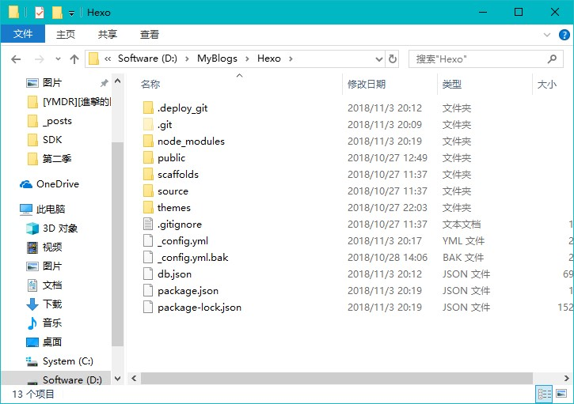

&emsp;&emsp;拥有自己的博客网站是一件很酷的事情。拖了很久，终于在近期成功搭建的自己的博客网站。现记录下搭建博客的方法步骤，以备不时之需。  
&emsp;&emsp;先来看看效果（建议使用Chrome浏览器）：[修之竹的小院时光](https://https://jinchaowen.github.io)  
&emsp;&emsp;网上搭建博客的方法有很多，个人推荐使用 Hexo + Github 组合。不仅因为免费开源，而且有许多美观的主题可选，还可以学到许多技能，简直一举多得！

## 啰嗦的简介
### [Hexo](https://hexo.io/zh-cn/)
&emsp;&emsp;这是一个快速、简洁且高效的博客框架。支持 GitHub Flavored Markdown 的所有功能，甚至可以整合 Octopress 的大多数插件。只需一条指令即可部署到 GitHub Pages、Heroku或其他网站。
### [GitHub](https://github.com)
&emsp;&emsp;GitHub是一个面向开源及私有软件项目的托管平台，因为只支持 git 作为唯一的版本库格式进行托管，故名GitHub(百度)。

## 正式开干
### Step1：
&emsp;&emsp;安装Git和Node.js。  
&emsp;&emsp;Git下载：[https://git-scm.com/downloads](https://git-scm.com/downloads) 选择相应系统版本进行下载。本人所用电脑是Windows 10，则下载 [Git-2.19.1-64-bit.exe](https://git-scm.com/download/win) 即可。安装完成后打开cmd，输入下面命令查看是否安装成功：  
`
git --version
`  
若可查询出git版本号，则说明安装成功。  
&emsp;&emsp;Node.js下载：[https://nodejs.org/en/](https://nodejs.org/en/) 新手建议选择左边的[Recommend For Most Users](https://nodejs.org/dist/v10.13.0/node-v10.13.0-x64.msi)版本。同样，安装完成后打开cmd，输入下面命令查询是否安装成功：  
`
node -v
`  
下面是一张测试图片：  
