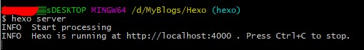

&emsp;&emsp;拥有自己的博客网站是一件很酷的事情。拖了很久，终于在近期成功搭建了自己的博客网站。现记录下搭建博客的方法步骤，以备不时之需。  
&emsp;&emsp;先来看看效果（建议使用Chrome浏览器）： [修之竹的小院时光](https://jinchaowen.github.io)  
&emsp;&emsp;网上搭建博客网站的方法有很多，个人推荐使用 Hexo + Github 组合。不仅因为免费开源，而且有许多美观的主题可选，还可以学到许多技能，简直一举多得！

## 啰嗦的简介
### [Hexo](https://hexo.io/zh-cn/)
&emsp;&emsp;这是一个快速、简洁且高效的博客框架。支持 GitHub Flavored Markdown 的所有功能，甚至可以整合 Octopress 的大多数插件。只需一条指令即可部署到 GitHub Pages、Heroku 或其他网站。
### [GitHub](https://github.com)
&emsp;&emsp;GitHub 是一个面向开源及私有软件项目的托管平台，因为只支持 git 作为唯一的版本库格式进行托管，故名 GitHub (百度)。

## 正式开干
### Step1：安装 Git 和 Node.js  
&emsp;&emsp;Git 下载：[https://git-scm.com/downloads](https://git-scm.com/downloads) 选择相应系统版本进行下载。本人所用电脑是 Windows 10，则下载 [Git-2.19.1-64-bit.exe](https://git-scm.com/download/win) 即可。安装完成后打开 cmd ，输入下面命令查看是否安装成功：  
`
git --version
`  
若可查询出 git 版本号，则说明安装成功。  
&emsp;&emsp;Node.js 下载： [https://nodejs.org/en/](https://nodejs.org/en/) 新手建议选择左边的 [Recommend For Most Users](https://nodejs.org/dist/v10.13.0/node-v10.13.0-x64.msi) 版本。同样，安装完成后打开 cmd ，输入下面命令查询是否安装成功：  
`
node -v
`  
都安装成功后进入下一步。  
### Step2：安装 Hexo  
&emsp;&emsp;首先，在自己的电脑上选择一个目录作为将要存放博客相关资料的文件夹。比如我自己选择的是 D 盘的 MyBlogs 目录，博客相关资料包括 Hexo 的配置文件、博客文档、使用的 Theme 主题文件等等。进入到你所选的文件夹中，点击鼠标右键，选择 `Git Bash Here` 打开 git 命令窗口，依次输入并执行下面命令：  
```
$ npm install hexo-cli -g    //安装 hexo 扩展插件  
$ hexo init blog    //在所选文件夹中创建一个 blog 文件夹，并把 hexo 相关代码下载到这个文件夹中  
$ cd blog    //进入到 blog 目录  
$ npm install    //安装 hexo  
$ hexo server    //启动本地服务
```
执行完上述命令后，显示器应该会提示说 Hexo 正在 http://localhost:4000 上运行：  

这个说明，hexo 在你的本地计算机上已经运行起来了，可以在你本地计算机上的浏览器中输入 [http://localhost:4000](http://localhost:4000) 网址查看显示效果，如果显示如下，那就说明，本地服务启动成功！  

如果要关闭本地服务，则在 Git Bash 命令窗口中输入 `Ctrl + C`  
OK ，目前本地我们可以访问了，接下来就要让其他人能访问你的博客网站了！ GitHub 要大显身手啦！  
### Step3：在 GitHub 上创建一个远程仓库  
&emsp;&emsp;如果还没有 GitHub 账号，墙裂推荐赶紧注册，注册好后往下走，如图。  

1、 点击右上角的 + 号创建一个仓库；
2、 设置仓库名称，这里必须为 username.github.io , username 替换成你 GitHub 自己的用户名，比如说我这里就是要设置为JinchaoWen.github.io  
剩下的步骤不是很主要，详细可看图，完成之后点击 Create repository 创建仓库。  
创建成功后如图所示：

这里有两个地址，一个是 Https ，一个是 SSH 。 Https 每次提交都需要输入用户名和密码，SSH 只要添加了 SSH key 值，以后提交就不需要输入用户名和密码。  
&emsp;&emsp;接下来要在 GitHub 中添加 SSH key 。首先检查本地是否已存在：  
```
$ cd ~/.ssh    //进入 .ssh 目录中
$ ls    //查看 .ssh 目录下的文件
```
如果本地有 SSH key ，则此时就会显示 id_rsa 、 id_rsa.pub 、 know_hosts 三个文件 。  
如果本地没有，再来创建 SSH key  
`
$ ssh-keygen -t rsa -C "你自己的邮箱地址"
`
把 "你自己的邮箱地址" 替换成你真实的邮箱，然后点击回车。接着会让你输入文件名，点击回车直接忽略，接着会让输入两次密码，点击两次回车，直接设置为空，不用输入密码。  
创建成功后，可通过下面命令拷贝密钥：  
`
$ clip < ~/.ssh/id_rsa.pub
`
然后，进入个人 GitHub 页面，点击自己的头像，选择 Setting 进入设置页面，再点击 SSH and GPG keys ，进入后点击 New SSH key，输入 Title 为你的 SSH key 起个名，然后 Ctrl + V 粘贴刚复制的 key 值，最后点击 Add SSH key 按钮即可添加进来。  
可通过如下命令检查是否添加成功：  
`
$ ssh -T git@github.com
`  
如果显示信息中包含 `You've successfully authenticated` 则说明添加成功！  
### Step4：配置博客主题修改网站设置
&emsp;&emsp;在之前生成的 blog 目录下找到配置文件 `_config.yml` ，用 EditPlus 或记事本打开，修改 depoly 如下：  
```
deploy:
  type: git 
  repo: git@github.com:username.github.io.git #username同上要换成你自己的用户名
  branch: master
```
修改 site 信息：  
```
title:    #给自己的博客网站起个名字
author:    #当然也要写上自己的大名
language: zh-Hans    #设置博客网站的语言，在这里如果设置为 zh-Hans 不管用，可以换成 zh-CN 试试。
```
给博客网站换装
在 GitHub 首页搜索 hexo theme ，可通过右边的过滤条件进行排序  

默认是按照项目的 star 数目进行排序筛选的，我们这里就选第一个了。仔细看项目的 ReadMe ，发现这个项目最新的版本已经迁移到这个网址了：  
[https://github.com/theme-next/hexo-theme-next](https://github.com/theme-next/hexo-theme-next)
建议使用新的这个，找到 Installation 说明：  
```
$ cd hexo
$ git clone https://github.com/theme-next/hexo-theme-next themes/next
```
注意了，目前你的目录中并没有 hexo 目录，这是因为他把 blog 文件夹名称改成了 hexo ，你也可以改成其他的名称，最好的是英文，中文我没试过。这里的意思是，将这个主题文件从 GitHub 的远程仓库拷贝到你的 blog 目录下的 themes 目录中，拷贝完成之后检查会发现多了一个 next 目录，这里就是刚刚下载的主题文件。  
然后返回到 blog 目录下，修改 _config.yml 中的 theme ：
`
theme : next
`
这就可以将之前的默认主题 landscape 更换成 next 新主题。  
接下来就是修改主题的配置文件 _config.yml 。注意： next 主题的配置文件是 blog/themes/next/_config.yml 这个，并不是 blog 根目录下的 _config.yml 文件！  
修改 menu ：
```
menu:
  home: / || home
  tags: /tags/ || tags
  categories: /categories/ || th
  archives: /archives/ || archive
  about: /about/ || user
  #schedule: /schedule/ || calendar
  #sitemap: /sitemap.xml || sitemap
  #commonweal: /404/ || heartbeat
```
根据自己的需要去掉注释，也可参照上面的。  
修改 Schemes ：  
```
scheme: Muse
#scheme: Mist
#scheme: Pisces
#scheme: Gemini
```
next 主题给我们提供了上述四种风格： 选择哪种就将哪种的注释去掉，并将给其他的加上注释，上面就是选择了 Muse 风格。   
编辑主题配置文件，启用自动摘录：  
```
auto_excerpt:
  enable: true
  length: 150
```
添加 LocalSearch 搜索功能：  
安装相关插件：  
```
$ npm install hexo-generator-searchdb --save
```
在 next 目录中的 _config.yml 设置，启用本地搜索功能：  
```
# Local search
local_search:
  enable: true
```
还可以添加一些博客网站的其他组件，具体的可以查看下面的他山之石中的第一篇：[如何搭建个人博客 ？Hexo + GitHub 是一个不错的选择](https://www.jianshu.com/p/eded1dd2d794)写的非常详细。  
快大功告成了，回到之前 blog 目录下，打开 Git Bash 命令窗口，运行`$ hexo g`命令生成静态文件，然后运行下面命令安装扩展插件：  
```
$ npm install hexo-deployer-git --save
```
最后执行`$ hexo d`命令部署到远程仓库，部署成功后就可以通过访问 http://username.github.io 进入博客网站了（ username 替换成你自己的 GitHub 用户名）。
## 更上一层楼
### 统计访客流量
&emsp;&emsp;超级建议从一开始就将这个小小的插件运用到自己的博客网站中，可以看到自己博客网站的阅读量，也是一种精神上的支持。这里借用了 [不蒜子](http://ibruce.info/2015/04/04/busuanzi/) 的统计插件。找到 `X:\xxxxx\Hexo\themes\next\layout\_partials` 路径下的 `footer.swig` 文件，用EditPlus或记事本打开，在最底部添加以下代码：  
```


	<script async src="//busuanzi.ibruce.info/busuanzi/2.3/busuanzi.pure.mini.js"></script>
	
    <span id="busuanzi_container_site_pv">总访问量<span id="busuanzi_value_site_pv"></span>次</span>
    <span class="post-meta-divider">|</span>
    <span id="busuanzi_container_site_uv">总访客<span id="busuanzi_value_site_uv"></span>人</span>
    <span class="post-meta-divider">|</span>


```
有些博客中不蒜子插件并不是最新的，所以可能会失效，建议以不蒜子官方帖子为准。
&emsp;&emsp;然后还要在next主题的设置文件中添加设置，就是这个文件： `themes/next/_config.yml` 找到footer字段，添加 `counter:true` ，如下所示：
```
footer:
  counter: true
```
到这里，可以保存一下，运行 `hexo g` 命令生成一下静态页面；然后运行 `hexo s` 命令启动本地服务器，在浏览器中输入 `http://localhost:4000 `查看效果，如果显示不对，仔细检查修改，如还有问题，欢迎邮箱联系 `wenjinchao@outlook.com`。
### 多终端维护博客网站
&emsp;&emsp;相信很多同学跟我一样，公司有一个本，自己有一个本，家里还有一个台式机，这么多设备能不能一起来维护自己的博客网站呢？git不就是这种思想吗？当然是可以的。  
&emsp;&emsp;首先在A电脑上按照上面的说明配置好了博客环境，以及可以正常发博客，拉取博客信息等。接下来，在A电脑的博客目录下打开Git Bash命令窗口，依次运行下面命令：
```
git branch hexo    //新建hexo分支
git checkout hexo    //切换到hexo分支上
git remote add origin git@github.com:yourname/yourname.github.io.git    //将本地与Github项目对接
git push origin hexo    //push到Github项目的hexo分支上
```
执行完后，你自己的博客GitHub项目中就会多出一个hexo分支，这个分支就是用来作多终端同步的功能。   
&emsp;&emsp;B电脑这边一开始也要像A电脑一样配置一下node、git等环境，具体就是完成“正式开干”的step1和step2，在这里我遇到过下面的问题，没有遇到的同学请跳过。  

找度娘之后，运行 `npm cache clean` 命令清理npm之后就可以了，如果还不能清理，可用 `npm cache clean --force` 强制清理。为了让B电脑也能操作hexo分支，所以也要设置一下B电脑的SSH key，步骤可参考前文。  
&emsp;&emsp;前面的工作准备完毕后，就可以进入你想要存放博客文件的目录中依次执行下面的命令：
```
git clone -b hexo git@github.com:yourname/yourname.github.io.git    //将Github中hexo分支clone到本地B电脑
cd yourname.github.io    //切换到刚刚clone的文件夹内
npm install    //注意，这里一定要切换到刚刚clone的文件夹内执行，安装必要的所需组件，不用再init
hexo new post "new blog name"    //新建一个.md文件，并编辑完成自己的博客内容
git add source    //经测试每次只要更新source中的文件到Github中即可，因为只是新建了一篇新博客
git commit -m "XX"
git push origin hexo    //更新远程hexo分支
hexo d -g    //生成博客静态页面，并将资源上传同步到远程博客网站中
```
执行完之后，就会发现刚刚在B电脑上新建的文章就出现在网站上了。所有的文章都会保存在 `\source\_posts` 目录中，以后可以直接打开这些 `.md` MarkDown格式的文件进行文章编辑，建议下载 `MarkdownPad` 软件进行编辑，支持预览。  
&emsp;&emsp;小建议：在开始编写或修改文章，或者修改配置文件之前，一定要在本地 `hexo` 分支下先拉取一下远程的 `hexo` 分支，即执行命令
```
git pull origin hexo
```
然后进行修改，编辑完成之后，依次执行
```
git add source    //提交修改的内容
git commit -m "XX"    //添加commit信息
git push origin hexo    //将更新后的hexo推到远程的hexo分支
hexo d -g    //生成博客静态页面，并将资源上传同步到远程博客网站中
```
过一段时间，就可以访问自己的博客网站查看更新后的博客内容了。
## 他山之石
- [如何搭建个人博客 ？Hexo + GitHub 是一个不错的选择](https://www.jianshu.com/p/eded1dd2d794)
- [网站访问量统计 | hexo](https://blog.csdn.net/qw8880000/article/details/80235391)
- [如何解决github+Hexo的博客多终端同步问题](https://blog.csdn.net/Monkey_LZL/article/details/60870891)